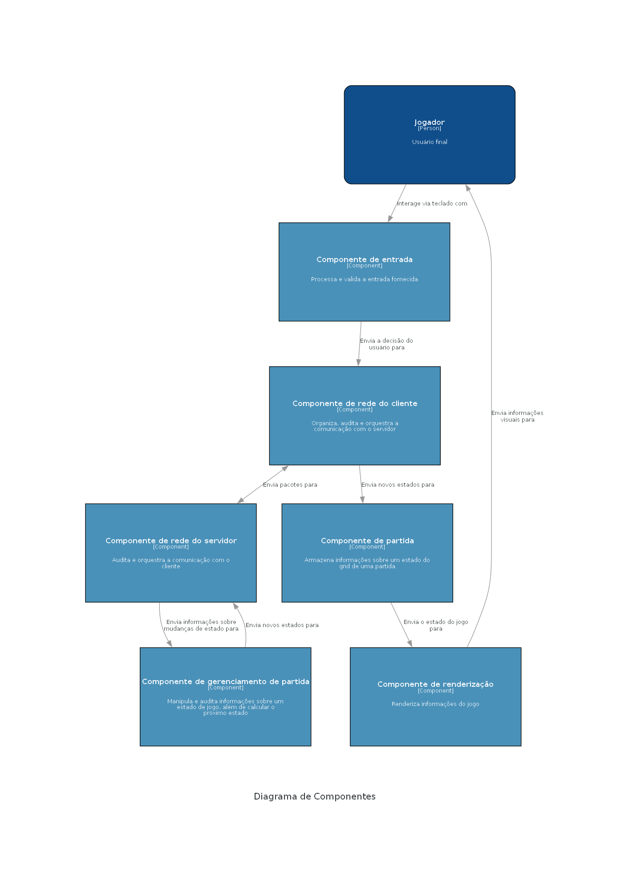

# Cobrinha multiplayer

O jogo é uma adaptação multijogador do clássico jogo da cobrinha. Em um mesmo campo, duas cobras competem para ter a maior pontuação.

O jogo possui dois pontos de entrada, o servidor e o cliente. O cliente é um programa interativo com interface de usuário em que é possível iniciar e jogar uma partida. O servidor é uma ferramenta no terminal que aceita conexões de clientes e mantém e sincroniza o estado do jogo, auditando as ações e movimentos dos clientes. Adotamos esse modelo para desacoplar a lógica de negócio do jogo e permitir que hospedemos o servidor em algum serviço de cloud futuramente caso se mostre necessário.

## Desenvolvedores
 - Rian Radeck Santos Costa - 187793
 - Cirilo Max Macedo de Morais Filho - 168838
 - Igor Brito Andrade - 171929

## Arquitetura do projeto
O estilo arquitetural adotado foi o cliente-servidor.

|  |
|:--:| 
| *Diagrama de Componentes C4* |

Os componentes são descritos como a seguir:

- Entrada: Responsável por validar e processar a entrada fornecida pelo usuário
- Renderização: Responsável por renderizar um estado do jogo na tela do usuário
- Partida: Armazena um estado completo do jogo, com atributos e informações relevantes para o componente de Renderização
- Gerenciamento de Partida: Manipula um estado do jogo e faz a lógica de negócio para o o cálculo de novos estados
- Redes: Borda de comunicação entre cliente e servidor, existem dois componentes desse tipo